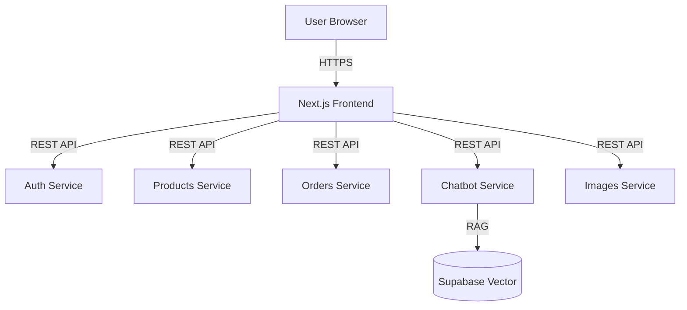

# UCB Commerce Frontend

A modern, responsive e-commerce interface built with Next.js 14, Tailwind CSS, and Shadcn UI.

## The Problem
University e-commerce platforms often suffer from fragmented user experiences, where students and administrators are forced to use disparate, outdated systems. We needed a solution that could:
1.  Provide a seamless, "Amazon-like" shopping experience for students.
2.  Offer a powerful, granular administration panel for career directors and platform admins.
3.  Unify these roles into a single, performant application without sacrificing security or speed.

## The Solution
UCB Commerce Frontend is a unified web application that dynamically adapts its interface based on user roles. It leverages Server-Side Rendering (SSR) for performance and SEO, while using a microservices architecture to offload complex logic to specialized backend services.

## Architecture


## Technical Decisions

### Why Next.js 14 (App Router)?
We chose Next.js for its **Server Components** architecture. This allows us to render critical content (like product details) on the server, improving First Contentful Paint (FCP) and SEO. It also simplifies data fetching by allowing us to call our microservices directly from the server, reducing client-side waterfalls.

### Why Shadcn UI + Tailwind CSS?
Instead of a heavy component library, we used **Shadcn UI** (headless components based on Radix UI) combined with **Tailwind CSS**. This gives us:
- **Accessibility**: Built-in keyboard navigation and screen reader support.
- **Customization**: Full control over the design system without fighting framework overrides.
- **Performance**: Zero runtime CSS overhead.

### Microservices Integration
The frontend acts as an **API Gateway** pattern implementation for the client. It aggregates data from multiple services (Auth, Products, Orders) and presents a cohesive view to the user, handling authentication tokens and error states transparently.

## Features
- **Role-Based Access Control (RBAC)**: Dynamic UI for Students, Career Admins, and Platform Admins.
- **Real-time Cart**: Persistent shopping cart state.
- **AI Chatbot Integration**: Floating assistant for instant support.
- **Optimized Images**: Automatic format selection and lazy loading.

## Tech Stack
- **Framework**: Next.js 14
- **Language**: TypeScript
- **Styling**: Tailwind CSS
- **State Management**: React Context + Hooks
- **Icons**: Lucide React

## Setup & Run

1.  **Install dependencies:**
    ```bash
    npm install
    # or
    pnpm install
    ```

2.  **Configure Environment Variables:**
    Create a `.env.local` file:
    ```env
    NEXT_PUBLIC_FIREBASE_API_KEY=...
    NEXT_PUBLIC_FIREBASE_AUTH_DOMAIN=...
    NEXT_PUBLIC_FIREBASE_PROJECT_ID=...
    # Microservices URLs
    AUTH_SERVICE_URL=http://localhost:8001
    ORDERS_SERVICE_URL=http://localhost:8002
    PRODUCTS_SERVICE_URL=http://localhost:8003
    ```

3.  **Run Development Server:**
    ```bash
    npm run dev
    ```
