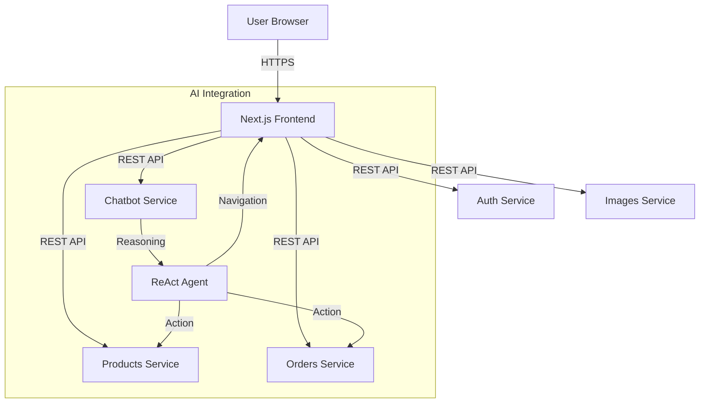

# UCB Commerce Frontend

[**Live Demo**](https://ucb-e-commerce.vercel.app)

A modern, responsive e-commerce interface built with Next.js 14, Tailwind CSS, and Shadcn UI. Now featuring a powerful **AI Assistant**.

## The Problem
University e-commerce platforms often suffer from fragmented user experiences. Students struggle to find specific products or get quick answers about stock and policies. Traditional search bars are limited, and support is often unavailable.

## The Solution
UCB Commerce Frontend is a unified web application that combines a premium shopping experience with an **intelligent ReAct Agent**. It allows users to interact with the store using natural language—asking questions, managing their cart, and even placing orders directly through chat.

## Architecture


## Key Features

### 🤖 AI Shopping Assistant
A persistent, intelligent chatbot that goes beyond simple Q&A:
-   **Natural Language Search**: "Show me hoodies under 200 Bs."
-   **Cart Management**: "Add the engineering hoodie to my cart."
-   **Direct Ordering**: "Buy the UCB mug." (Chains add-to-cart + order creation).
-   **Auto-Navigation**: The agent can redirect you to specific product pages automatically.
-   **Memory**: Remembers your conversation context across page reloads.

### 🛍️ Modern E-Commerce Core
-   **Role-Based Access Control (RBAC)**: Dynamic UI for Students, Career Admins, and Platform Admins.
-   **Real-time Cart**: Persistent shopping cart state synchronized with the backend.
-   **Optimized Performance**: Server-Side Rendering (SSR) for critical content.
-   **Responsive Design**: Mobile-first approach using Tailwind CSS.

## Technical Decisions

### Why Next.js 14 (App Router)?
We chose Next.js for its **Server Components** architecture. This allows us to render critical content (like product details) on the server, improving First Contentful Paint (FCP) and SEO. It also simplifies data fetching by allowing us to call our microservices directly from the server.

### Why Shadcn UI + Tailwind CSS?
Instead of a heavy component library, we used **Shadcn UI** (headless components based on Radix UI) combined with **Tailwind CSS**. This gives us accessibility, full customization control, and zero runtime CSS overhead.

### Microservices Integration
The frontend acts as an **API Gateway** pattern implementation for the client. It aggregates data from multiple services and presents a cohesive view to the user.

**Connected Services:**
- [Products Service](https://github.com/ChristianMendozaa/products_service_UCB_commerce)
- [Auth Service](https://github.com/ChristianMendozaa/auth_UCB_commerce)
- [Chatbot Service](https://github.com/ChristianMendozaa/chatbot_servive_UCB_commerce)
- [Images Service](https://github.com/ChristianMendozaa/images_services_UCB_commerce)
- [Orders Service](https://github.com/ChristianMendozaa/orders_service_UCB_commerce)

## Tech Stack
-   **Framework**: Next.js 14
-   **Language**: TypeScript
-   **Styling**: Tailwind CSS
-   **State Management**: React Context + Hooks
-   **Icons**: Lucide React
-   **AI Integration**: Custom Chat Widget with ReAct Agent backend

## Setup & Run

1.  **Install dependencies:**
    ```bash
    npm install
    # or
    pnpm install
    ```

2.  **Configure Environment Variables:**
    Create a `.env.local` file:
    ```env
    NEXT_PUBLIC_FIREBASE_API_KEY=...
    NEXT_PUBLIC_FIREBASE_AUTH_DOMAIN=...
    NEXT_PUBLIC_FIREBASE_PROJECT_ID=...
    # Microservices URLs
    AUTH_SERVICE_URL=http://localhost:8001
    ORDERS_SERVICE_URL=http://localhost:8002
    PRODUCTS_SERVICE_URL=http://localhost:8003
    ```

3.  **Run Development Server:**
    ```bash
    npm run dev
    ```
