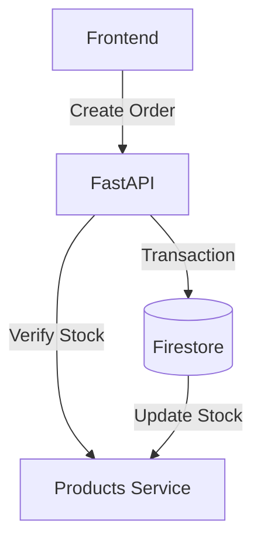

# Orders Service - UCB Commerce

The transactional heart of the platform, managing the lifecycle of customer orders from cart checkout to delivery.

## The Problem
E-commerce transactions are critical. A "race condition" where two students buy the last item simultaneously must be prevented. We needed a system that guarantees data integrity and provides a clear audit trail of order states.

## Architecture

```mermaid
graph TD
    Frontend -->|Create Order| API[FastAPI]
    API -->|Verify Stock| Products[Products Service]
    API -->|Transaction| DB[(Firestore)]
    DB -->|Update Stock| Products
```

## Technical Decisions

### Transactional Integrity
We implement strict checks before order creation. The service communicates with the Products Service to lock/verify stock before confirming an order. This distributed transaction pattern ensures we never oversell inventory.

### State Machine Logic
Orders follow a strict state flow (Pending -> Confirmed -> Shipped -> Delivered). This state machine is enforced at the API level, preventing invalid transitions (e.g., moving from "Delivered" back to "Pending").

## Features
- **Order Creation**: Multi-item support with total calculation.
- **Status Tracking**: Real-time updates for students.
- **Admin Dashboard**: Career-specific order views for administrators.

## Tech Stack
- **Language**: Python 3.10+
- **Framework**: FastAPI
- **Database**: Google Firestore

## Setup & Run

1.  **Install dependencies:**
    ```bash
    pip install -r requirements.txt
    ```

2.  **Configure Environment Variables:**
    Set up `.env` with Firestore credentials.

3.  **Run Server:**
    ```bash
    uvicorn app.main:app --reload --port 8002
    ```