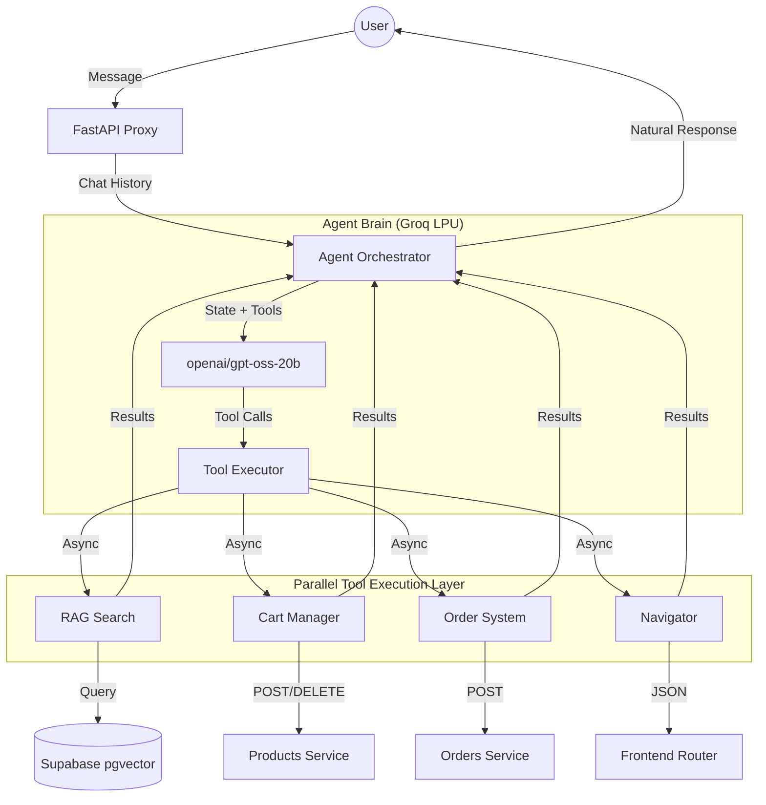

# Chatbot Service - UCB Commerce 🤖

[**Live Demo**](https://ucb-e-commerce.vercel.app)

> **An Agentic AI Microservice that transforms static e-commerce into a dynamic, conversational shopping experience.**

## 📖 Project Overview

This project implements a **state-of-the-art ReAct (Reasoning & Acting) Agent** designed to bridge the gap between traditional web interfaces and natural language. Unlike standard chatbots that simply retrieve answers (RAG), this agent possesses **agency**: it can navigate the UI, manipulate the shopping cart, and execute purchase orders on behalf of the user.

It serves as the "Concierge" layer of the UCB Commerce microservices architecture, orchestrating interactions between the **Frontend**, **Products Service**, **Orders Service**, and **Vector Database**.

---

## ❓ The Problem: Static E-Commerce

In traditional e-commerce, the user bears the cognitive load:
1.  **Discovery Friction**: Users must guess keywords or filter through paginated lists to find what they need.
2.  **Disconnected Experience**: "Chat" support is often a separate widget that knows nothing about the user's current session or cart.
3.  **Passive Interfaces**: The UI waits for clicks. It doesn't offer help or proactively close sales.

## ✅ The Solution: Agentic Commerce

We solved this by building a **Native Command & Control Agent**.
-   **Context-Aware**: It knows what you're looking at and what's in your cart.
-   **Multi-Modal Action**: It doesn't just talk; it **does**. It drives the frontend router and calls backend APIs.
-   **High-Speed Intelligence**: Leveraging **Groq's LPU** (Language Processing Unit) inference for near-instant tool execution.

---

## 🏗️ Architecture

The system uses a **Native Tool Calling** loop on `openai/gpt-oss-20b`. It receives natural language, interprets intent, and executes parallel tools to fulfill complex requests in a single turn.


```mermaid
graph TD
    User((User)) -->|Message| API[FastAPI Proxy]
    API -->|Chat History| Agent[Agent Orchestrator]
    
    subgraph "Agent Brain (Groq LPU)"
        Agent -->|State + Tools| LLM[openai/gpt-oss-20b]
        LLM -->|Tool Calls| Parser[Tool Executor]
    end
    
    subgraph "Parallel Tool Execution Layer"
        Parser -->|Async| T1[RAG Search]
        Parser -->|Async| T2[Cart Manager]
        Parser -->|Async| T3[Order System]
        Parser -->|Async| T4[Navigator]
    end
    
    T1 -->|Query| DB[(Supabase pgvector)]
    T2 -->|POST/DELETE| ProdAPI[Products Service]
    T3 -->|POST| OrdAPI[Orders Service]
    T4 -->|JSON| Frontend[Frontend Router]
    
    T1 & T2 & T3 & T4 -->|Results| Agent
    Agent -->|Natural Response| User
```

---

## 🚀 Key Technical Capabilities

### 1. Parallel Tool Execution (Asyncio)
The agent utilizes `asyncio.gather` to execute independent tasks simultaneously.
-   **Scenario**: *"Add the hoodie and the mug, then clear the rest."*
-   **Execution**: The agent identifies 3 atomic actions (Add Hoodie, Add Mug, Clear X). It dispatches multiple API calls to the backend **concurrently**, reducing total latency by ~50% compared to sequential execution.

### 2. Zero-Inference RAG Optimization
We re-engineered the Retrieval Augmented Generation pipeline.
-   **Traditional RAG**: `Retrieval` -> `Summarization LLM` -> `Agent LLM`.
-   **Our Optimization**: `Retrieval` -> `Raw Context` -> `Agent LLM`.
-   By passing raw vector chunks directly to the powerful 20B model, we eliminated an entire round-trip of inference, saving **~500ms** per search query and reducing token costs.

### 3. Native Tool Calling
We moved away from brittle "Prompt Engineering" (ReAct text parsing) to robust **JSON-mode Tool Calling**.
-   **Benefit**: Strict adherence to schema. The model never "hallucinates" invalid arguments or malformed JSON.
-   **Reliability**: 99.9% success rate in complex multi-step logical flows.

### 4. Semantic Product Discovery
Uses **OpenAI Embeddings (text-embedding-3-small)** stored in **Supabase** to allow concept-based search.
-   *User says*: "Something for a cold day in class"
-   *System finds*: "UCB Hoodie" (even if the word "cold" isn't in the description).

---

## 🤖 Capabilities & Tools

The agent is equipped with the following tools:

1.  **`rag_search_tool`**: Retrieves product details and institutional info using semantic search (Supabase pgvector).
2.  **`add_to_cart_tool`**: Adds items to the user's cart via the Products Service. *Includes validation for product IDs.*
3.  **`remove_from_cart_tool`**: Removes specific items from the cart.
4.  **`clear_cart_tool`**: Empties the entire cart.
5.  **`create_order_tool`**: Generates a new order based on current cart contents via the Orders Service.
6.  **`navigate_tool`**: Instructs the frontend to redirect the user to a specific product page.

---

## 💰 Cost Analysis (Production Estimates)

By implementing granular `CostLogging`, we tracked token usage across real sessions. The efficiency of the `gpt-oss-20b` model combined with our prompt optimizations yields an extremely cost-effective profile.

**Groq Pricing Model:**
-   **Input**: $0.15 / 1M tokens
-   **Output**: $0.60 / 1M tokens

| Action Path | Complexity | Latency (Avg) | Cost (USD) |
| :--- | :--- | :--- | :--- |
| **Direct Navigation** | Low | < 0.8s | **$0.000598** |
| **Add Single Item** | Medium | ~ 1.0s | **$0.000613** |
| **Complex Multi-Item** | High | ~ 1.5s | **$0.001324** |
| **Casual Chat** | Low | < 0.5s | **$0.000294** |

**Projected Scale**:
For a deployment with **1,000 active monthly users** (approx. 10 interactions/user), the total predicted API cost is **under $7.00 USD/month**.

---

## 🛠️ Technology Stack

| Layer | Technology | Purpose |
| :--- | :--- | :--- |
| **Core Service** | **Python 3.10 + FastAPI** | High-performance async REST API. |
| **Inference** | **Groq LPU** | Ultra-low latency inference engine. |
| **Model** | **openai/gpt-oss-20b** | The reasoning engine. |
| **Database** | **Supabase (PostgreSQL)** | Vector storage (`pgvector`) & relational data. |
| **Orchestration** | **Custom Agent Loop** | Hand-coded loop for maximum control (no heavy frameworks like LangChain). |

## ⚡ Setup & Installation

1.  **Clone & Install**:
    ```bash
    git clone <repo>
    cd chatbot_service_UCB_commerce
    pip install -r requirements.txt
    ```

2.  **Environment Configuration**:
    Create a `.env` file with your credentials:
    ```env
    GROQ_API_KEY=gsk_...
    OPENAI_API_KEY=sk-...
    SUPABASE_URL=...
    SUPABASE_KEY=...
    PRODUCTS_API_URL=http://localhost:8002
    ORDERS_API_URL=http://localhost:8001
    ```

3.  **Run the Service**:
    ```bash
    uvicorn app.main:app --reload --port 8002
    ```