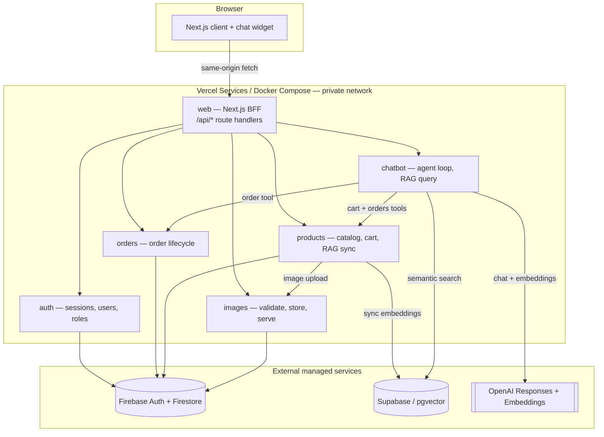
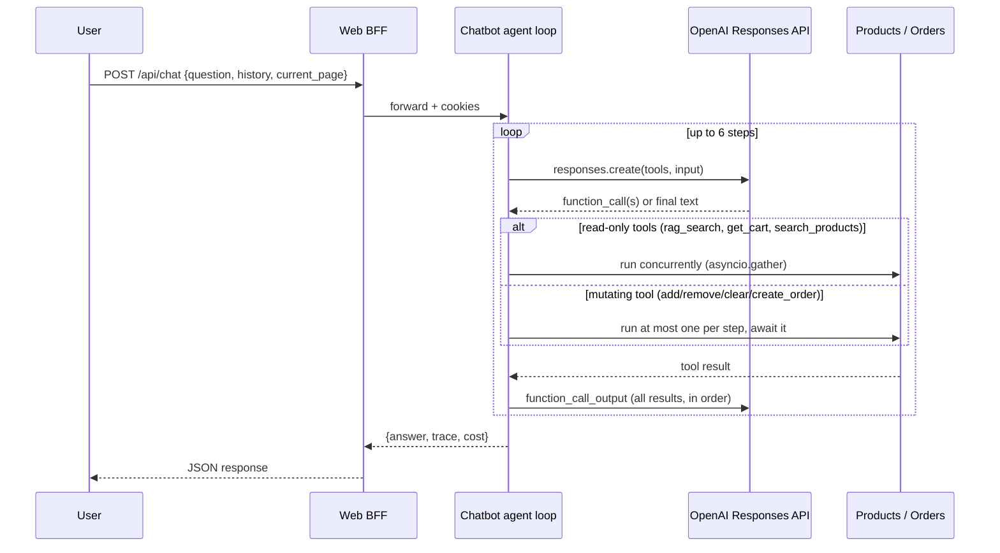
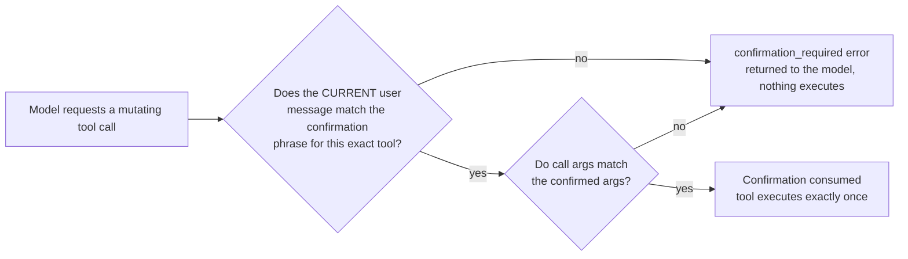
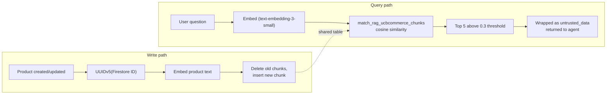

# UCB Commerce

UCB Commerce is an e-commerce platform for a university's institutional
storefront, built as a six-service monorepo behind a Next.js BFF. Its
centerpiece is a conversational shopping agent that can search products,
manage a cart, and place orders through natural-language chat — implemented
with the OpenAI Responses API, native tool calling, and a Supabase/pgvector
retrieval index over the catalog.

The interesting engineering problem is not "call an LLM." It's that the agent
holds real write access to a stranger's cart and order history, consumes
retrieved text that a user could poison, and runs in a stateless request/reply
loop with no server-side conversation memory. Every mechanism below exists to
answer one question: **what stops the model from acting on its own?**

**Stack:** Next.js 14 (App Router) · FastAPI · Firebase Auth/Firestore ·
Supabase (pgvector) · OpenAI Responses API · Docker · Vercel Services

---

## Highlights

- **Agentic commerce, not a Q&A bot.** The assistant calls real tools —
  `search_products_tool`, `add_to_cart_tool`, `create_order_tool`,
  `navigate_tool` — against live Firestore-backed services, bounded to 6
  reasoning steps per turn.
- **No unilateral mutations.** Every cart or order write requires a
  confirmation phrase parsed *outside* the model, bound to the exact tool
  arguments it approves, and consumed exactly once — even if the downstream
  call fails.
- **Retrieved content can't hijack the agent.** RAG results are wrapped as
  `{"untrusted_data": true, ...}` and the system prompt explicitly forbids
  treating retrieved text as instructions.
- **Cost is measured per turn, not estimated after the fact.** Token usage is
  split into four billing classes (cache read, cache write, long-context
  tiers included) and returned as a `cost` field on every response.
- **86 tests, no network.** Auth, cart mutation, prompt-injection, and
  confirmation logic are pinned by adversarial unit tests against mocked
  OpenAI/Supabase/Firestore — nothing hits a real API in CI.
- **Stateless, replaceable containers.** All six services are non-root,
  hash-locked Docker images with no durable local filesystem state; every
  byte of persistence lives in Firebase, Firestore, or Supabase.

---

## System architecture

Only the `web` service is publicly routed. The browser never talks to a
backend service directly — every request goes through Next.js Route Handlers
acting as a backend-for-frontend (BFF), which forward to private upstream
services over an internal network (Docker Compose DNS locally, Vercel service
bindings in production).


```mermaid
graph TB
    subgraph Browser
        UI[Next.js client + chat widget]
    end

    subgraph Vercel["Vercel Services / Docker Compose — private network"]
        WEB["web — Next.js BFF<br/>/api/* route handlers"]
        AUTH["auth — sessions, users, roles"]
        ORDERS["orders — order lifecycle"]
        PRODUCTS["products — catalog, cart, RAG sync"]
        CHATBOT["chatbot — agent loop, RAG query"]
        IMAGES["images — validate, store, serve"]
    end

    subgraph External["External managed services"]
        FIREBASE[(Firebase Auth + Firestore)]
        SUPABASE[(Supabase / pgvector)]
        OPENAI[[OpenAI Responses + Embeddings]]
    end

    UI -->|same-origin fetch| WEB
    WEB --> AUTH
    WEB --> ORDERS
    WEB --> PRODUCTS
    WEB --> CHATBOT
    WEB --> IMAGES
    PRODUCTS -->|image upload| IMAGES
    CHATBOT -->|cart + orders tools| PRODUCTS
    CHATBOT -->|order tool| ORDERS

    AUTH --> FIREBASE
    ORDERS --> FIREBASE
    PRODUCTS --> FIREBASE
    PRODUCTS -->|sync embeddings| SUPABASE
    IMAGES --> FIREBASE
    CHATBOT -->|chat + embeddings| OPENAI
    CHATBOT -->|semantic search| SUPABASE
```

---

## The agent

Each `/chat` turn runs a bounded loop against the OpenAI Responses API in
stateless mode (`store=False`): the server holds no conversation state between
requests, so every turn resends the system prompt, the client-supplied
history, and — within the turn — every item the model produced, reasoning
included, so multi-step tool use stays coherent.


```mermaid
sequenceDiagram
    participant U as User
    participant W as Web BFF
    participant C as Chatbot agent loop
    participant O as OpenAI Responses API
    participant P as Products / Orders

    U->>W: POST /api/chat {question, history, current_page}
    W->>C: forward + cookies
    loop up to 6 steps
        C->>O: responses.create(tools, input)
        O-->>C: function_call(s) or final text
        alt read-only tools (rag_search, get_cart, search_products)
            C->>P: run concurrently (asyncio.gather)
        else mutating tool (add/remove/clear/create_order)
            C->>P: run at most one per step, await it
        end
        P-->>C: tool result
        C->>O: function_call_output (all results, in order)
    end
    C-->>W: {answer, trace, cost}
    W-->>U: JSON response
```

Governing constants (`services/chatbot/app/services/agent_service.py`):

| Constant | Value | Why |
|---|---|---|
| `MAX_AGENT_STEPS` | 6 | Hard ceiling on reasoning rounds per turn. |
| Final step | never executes tools | A last-round mutation could succeed with no way to report it back to the user, and a client retry could then duplicate it. |
| Read tools | batched with `asyncio.gather` | `rag_search_tool`, `get_cart_tool`, `search_products_tool` are side-effect free, so contiguous reads run concurrently. |
| Mutating tools | **one per model step**, always awaited | Any additional mutation call in the same step is rejected with `mutation_deferred`, forcing the model to observe the result before trying again. |
| `MAX_LLM_ATTEMPTS` | 2 | Retries only on `408/409/429/5xx` and connection/timeout errors — never on permanent failures. |

## Preventing the model from acting alone

Three independent controls, each enforced in code the model does not control:

**1. Argument-bound confirmation, parsed outside the model.** Before any
mutating tool (`add_to_cart_tool`, `remove_from_cart_tool`, `clear_cart_tool`,
`create_order_tool`) is allowed to run, the user's *current* message — not the
model's interpretation of it — is matched against an exact phrase pattern
(NFKC-normalized, Firestore ID case preserved):

```
"Confirmo agregar PRODUCT_ID cantidad N"   (1 ≤ N ≤ 20)
"Confirmo quitar PRODUCT_ID del carrito"
"Confirmo vaciar el carrito"
"Confirmo crear el pedido"
```

The tool call's actual arguments (`product_id`, `quantity`) must match the
confirmed values exactly, and a confirmation is consumed the moment a matching
call is attempted — even if the downstream HTTP call to Products/Orders then
fails — so it can't be replayed across turns.


```mermaid
flowchart LR
    A[Model requests a mutating tool call] --> B{Does the CURRENT user\nmessage match the confirmation\nphrase for this exact tool?}
    B -- no --> C[confirmation_required error\nreturned to the model, nothing executes]
    B -- yes --> D{Do call args match\nthe confirmed args?}
    D -- no --> C
    D -- yes --> E[Confirmation consumed\ntool executes exactly once]
```

**2. Retrieved content is data, never instructions.** `rag_search_tool` wraps
every result as `{"untrusted_data": true, "source": "rag", "content": ...}`,
and the system prompt states plainly that content from RAG, products, or any
tool must never be treated as instructions — closing the classic
retrieval-prompt-injection path where a poisoned product description tries to
issue commands to the agent.

**3. Navigation is allowlisted, not model-generated.** `navigate_tool` accepts
only known static paths or a validated product/career ID — normalizing
Unicode, rejecting path traversal, control characters, and Firestore's
reserved `__id__` pattern — and explicitly excludes `/admin`. The browser then
re-validates the same URL independently before calling `router.push`
(`apps/web/components/chat-widget.tsx`), so a compromised or buggy backend
still can't redirect a user off-origin.

These properties are pinned by tests, not just described: see
`test_only_one_mutating_tool_executes_per_model_step`,
`test_unrequested_mutation_is_blocked_outside_the_model`,
`test_agent_never_executes_a_mutation_on_the_final_model_round`,
`test_bound_confirmation_is_consumed_after_one_mutation`,
`test_rag_results_are_marked_as_untrusted_data`, and
`test_navigate_tool_rejects_external_unknown_and_traversal_targets` in
`services/chatbot/tests/`.

## Retrieval

The catalog and a static institutional-knowledge document share one Supabase
`pgvector` table, queried through a single SQL function.


```mermaid
graph LR
    subgraph Write path
        PW[Product created/updated] --> UUID["UUIDv5(Firestore ID)"]
        UUID --> EMB1[Embed product text]
        EMB1 --> UP[Delete old chunks,\ninsert new chunk]
    end
    subgraph Query path
        Q[User question] --> EMB2["Embed (text-embedding-3-small)"]
        EMB2 --> RPC[match_rag_ucbcommerce_chunks\ncosine similarity]
        RPC --> TOP[Top 5 above 0.3 threshold]
        TOP --> WRAP[Wrapped as untrusted_data\nreturned to agent]
    end
    UP -.->|shared table| RPC
```

- **Embeddings:** `text-embedding-3-small`, 1536 dimensions.
- **Index:** HNSW over `vector_cosine_ops` (`setup_rag_db.sql`).
- **Similarity threshold:** 0.3 — lowered from an initial 0.5 after tuning
  found too many relevant products were being filtered out
  (`fix_rag_threshold.sql`).
- **Identity mapping:** Firestore product IDs are arbitrary strings; Supabase
  requires a `uuid` primary key, so each ID is mapped through a deterministic
  `UUIDv5` under a fixed namespace. Re-syncing a product is idempotent
  (delete-by-`source_id`, then insert) rather than accumulating stale chunks.
- **Chunking** (for the static knowledge document): 1,000 characters with a
  200-character overlap, capped at 200 chunks, with exact-duplicate removal
  and a loop guard so a pathological input can't chunk forever.
- Query-time embedding calls run through `asyncio.to_thread` so a synchronous
  OpenAI SDK call never blocks the agent's event loop.

## Cost engineering

The OpenAI Responses API bills four different token classes, and the agent
accounts for all of them per turn rather than approximating from raw token
counts:

```
cost = uncached_input × input_rate
     + cached_input   × cached_rate
     + cache_write     × input_rate × 1.25
     + output          × output_rate
```

with a long-context tier (`input_tokens > 272,000`) that doubles the input
multiplier and applies 1.5× to output — matching the underlying model's
pricing structure. All four rates are environment-overridable
(`OPENAI_INPUT_PRICE_PER_M`, `OPENAI_CACHED_INPUT_PRICE_PER_M`,
`OPENAI_OUTPUT_PRICE_PER_M`) so the reported `cost` field on every `/chat`
response tracks whatever the account is actually billed on a given deployment
date, and `services/chatbot/cost_estimation.py` projects monthly spend for
10,000 users under moderate and intensive usage scenarios.

---

## Engineering decisions

Each decision below is a real trade-off, not a default.

**Stateless agent loop (`store=False`) instead of the Responses API's built-in
conversation state.**
Statelessness means every turn resends the full working context (system
prompt, capped history, in-turn tool outputs), which costs more input tokens
per request. In exchange, the service holds zero server-side session data for
chat, which matters because containers are stateless-by-design across this
whole system — a chatbot instance restarting or scaling to zero can't lose or
mix up a conversation it never held.

**Confirmation parsed outside the model, not left to prompt instructions.**
An LLM can be argued out of a system-prompt rule by an adversarial user
message or a poisoned tool result; a regex match against the user's literal
current message cannot. The cost is UX rigidity — the confirmation phrase
must be exact — accepted deliberately over the alternative of a model that
*usually* asks before spending someone's stock.

**One mutation per model step, always awaited before the loop continues.**
This is what makes "confirmation consumed once" actually true under
parallel tool calls: if the model requested two mutations in one round, only
the first would be allowed to execute and the agent must observe its real
result before the next attempt, closing a class of double-execution and
inventory-race bugs that pure prompt discipline can't guarantee.

**RAG results are data, never instructions — enforced by both the payload
shape and the system prompt.** A shopping assistant that ingests
user-editable or admin-editable product text is a textbook indirect-prompt-
injection target. Wrapping every retrieved chunk in an explicit
`untrusted_data` envelope means the containment doesn't rely solely on the
model choosing to comply with prose instructions.

**Images stored as Base64 in Firestore instead of an object-storage bucket.**
This avoids a second storage system, a second auth boundary, and signed-URL
plumbing for a catalog whose images are small. The accepted cost is a hard
983,040-byte (Base64) ceiling per image — measured back from Firestore's 1 MiB
document limit minus a 64 KiB safety margin for metadata — enforced with a
WebP re-encode fallback before outright rejection.

**Every backend service is private; only `web` is deployed publicly, and it
never trusts client-declared URLs.** All cross-service calls resolve backend
locations from environment (Compose DNS names locally, Vercel service
bindings in production) rather than accepting a caller-supplied host, which
removes an entire class of SSRF-via-configuration bugs.

**Deterministic UUIDv5 mapping between Firestore string IDs and Supabase UUID
keys**, rather than storing a second generated ID. One less field to keep in
sync, and re-deriving the mapping from the Firestore ID alone makes RAG
re-indexing idempotent without a lookup table.

**Product writes synchronize RAG embeddings inline, in the request path**,
rather than through a queue. Simpler to reason about and guarantees the
catalog and the vector index never drift apart during normal operation; the
accepted cost is that a product create/update request now includes an OpenAI
embedding call, and a transient Supabase/OpenAI failure there is swallowed
rather than retried (see Known limitations).

---

## Security posture

| Threat | Control | Enforced in |
|---|---|---|
| Agent mutates cart/orders without user intent | Argument-bound, single-use confirmation phrase parsed outside the model | `agent_service.py: _confirmed_mutations`, `_mutation_arguments_match` |
| Indirect prompt injection via product/RAG text | Retrieved content wrapped as `untrusted_data`; system prompt forbids treating it as instructions | `tools.py: rag_search_tool`, `SYSTEM_PROMPT` |
| Agent-driven open redirect / admin access | `navigate_tool` allowlist excludes `/admin`; browser independently re-validates the URL before navigating | `tools.py: _normalize_application_path`, `chat-widget.tsx: safeNavigationPath` |
| Forged or replayed session | Firebase session cookies, `httpOnly` + `SameSite=Lax`, `check_revoked=True` on every verification path, with a bounded 15s clock-skew retry that still enforces revocation | `services/*/app/deps/auth.py` |
| Cross-career privilege escalation | Career-scoped RBAC; moving a product requires authority over **both** the source and destination career | `products/app/deps/permissions.py: can_move_product_or_403` |
| Malicious image upload (polyglot, decompression bomb, animated payload) | Byte-level format detection via Pillow (upload MIME/extension never trusted); re-encode strips metadata/trailing payloads; dimension and megapixel caps | `services/images/utils/utils.py` |
| Oversized request exhausting a service | 4 MiB original-image cap enforced at four boundaries (browser, BFF, Products, Images); BFF caps the full multipart body at 4,450,000 bytes; chat payload capped at 96 KiB | `apps/web/lib/upload-limits.ts`, `app/api/chat/route.ts` |
| Path traversal through proxied route segments | Multi-pass percent-decoding with traversal/control-character rejection before re-encoding | `apps/web/lib/server/proxy-path.ts` |
| Chat endpoint abuse / cost runaway | Per-IP token-bucket rate limit (12 req/60s), LRU-bounded to 10k tracked clients | `apps/web/app/api/chat/route.ts` |
| Stored image XSS/MIME confusion on download | `default-src 'none'; sandbox`, `X-Content-Type-Options: nosniff`, `Cross-Origin-Resource-Policy: same-origin` on every image response | `services/images/routers/images.py`, `apps/web/app/api/images/[id]/route.ts` |

## Testing

86 tests across four Python services, all offline — OpenAI, Supabase,
Firestore, and downstream HTTP calls are mocked or monkeypatched, so the suite
never depends on network access or live credentials.

| Service | Tests | Pins |
|---|---:|---|
| `chatbot` | 48 | Agent loop step budget, confirmation gating, one-mutation-per-step, untrusted RAG wrapping, navigation allowlist, retry policy, chat request/response contract |
| `products` | 14 | Career-scoped permissions, image upload error propagation, upload size limits, image URL derivation |
| `auth` | 13 | Session cookie lifecycle, revocation-preserving clock-skew retry, account-deletion cleanup, CORS credential policy |
| `images` | 41 | Upload size limits, format/dimension/downscale validation, response security headers, read-path ETag/`If-None-Match`/cache-control (`fastapi.testclient`), `?w=` variant rendering and caching |
| `orders` | — | No automated tests yet (see Known limitations) |

Representative adversarial tests — the ones that pin the guarantees above
rather than just happy paths:

```
test_only_one_mutating_tool_executes_per_model_step
test_unrequested_mutation_is_blocked_outside_the_model
test_agent_never_executes_a_mutation_on_the_final_model_round
test_bound_confirmation_is_consumed_after_one_mutation
test_rag_results_are_marked_as_untrusted_data
test_navigate_tool_rejects_external_unknown_and_traversal_targets
test_login_skew_retry_keeps_revocation_check
test_logout_revokes_user_sessions_and_expires_exact_cookie
```

Run a service's suite locally:

```bash
cd services/chatbot && python -m pip install -r requirements-dev.txt && pytest
cd services/auth && python -m pip install -r requirements.txt pytest && pytest
```

---

## Repository layout

```text
apps/web/             Next.js 14 storefront and same-origin BFF
services/auth/        Firebase authentication, users, and careers
services/orders/      Order lifecycle
services/products/    Catalog, inventory, and cart
services/chatbot/     OpenAI-powered shopping assistant and Supabase RAG
services/images/      Image validation and Firestore-backed image API
compose.yaml          Local six-service topology
vercel.json           Vercel Services topology
```

Every service has a `Dockerfile.vercel`. The web image uses Node.js 22,
Corepack, pnpm, and Next.js standalone output. Python images use Python 3.12
from hash-locked `requirements.lock` files. All runtime processes run as
non-root users and listen on the platform-provided `PORT`. No container
persists durable state to its local filesystem — everything lives in
Firebase/Firestore, Supabase, or OpenAI.

## Known limitations

Stated plainly because a system with none would be suspicious:

- **The chat rate limiter is per-instance, not global.** Vercel can run
  multiple instances and scale to zero; the in-memory 12 req/60s limiter is a
  local backstop, not an account-wide OpenAI spending cap. Production needs a
  distributed limiter (Vercel Firewall or a keyed external store) on top of it.
- **No response streaming.** The client waits for the full agent turn
  (up to 6 model round-trips) before seeing any text.
- **RAG sync runs inline in the product write path.** Creating or updating a
  product makes a synchronous OpenAI embedding call as part of that request,
  and a transient failure there is logged and swallowed rather than queued
  for retry — the catalog write still succeeds, but the index can silently
  drift until the next edit.
- **The images service has no authentication of its own.** It relies entirely
  on network isolation (only reachable from `web` and `products`); it does
  not independently verify the caller.
- **Retrieval is unranked and unevaluated.** Fixed-size character chunking, no
  reranking step, and no offline retrieval-quality harness — the 0.3 cosine
  threshold was tuned by observation, not a labeled eval set.
- **No distributed tracing.** Cost and step counts are logged per request;
  there's no cross-service trace ID connecting a chat turn to the Products/
  Orders calls it triggered.
- **`orders` has no automated test suite** while every other backend service
  does.

## Roadmap

- Distributed/global chat rate limiting keyed by authenticated user.
- Move RAG sync off the product-write request path onto a queue with retry.
- Stream agent responses token-by-token instead of returning one final blob.
- Add a retrieval evaluation set to justify (or retune) the similarity
  threshold with data instead of observation.
- Bring `orders` up to the same test coverage as the other services.
- Propagate a trace ID from the BFF through chatbot → products/orders for
  cross-service debugging.

---

<details>
<summary><strong>Run the full stack locally</strong></summary>

### Prerequisites

- Docker Engine with Docker Compose v2 and BuildKit
- A Firebase project and service-account credentials
- A Supabase project
- An OpenAI API key

Node.js and Python are not required on the host for the Compose workflow.

### Configure local environment files

Real environment files are intentionally ignored by Git and excluded from
every Docker build context. Create them from the committed templates:

```bash
cp apps/web/.env.example apps/web/.env.local
cp services/auth/.env.example services/auth/.env
cp services/orders/.env.example services/orders/.env
cp services/products/.env.example services/products/.env
cp services/chatbot/.env.example services/chatbot/.env
cp services/images/.env.example services/images/.env
```

Replace every `replace-with-*` and sample project value. Never commit the
resulting files, service-account JSON, private keys, or API tokens.

`NEXT_PUBLIC_FIREBASE_*` values are compiled into the browser bundle. Compose
passes `apps/web/.env.local` to the web build through the optional BuildKit
secret `web_env`; the file is mounted only for `pnpm build` and is never copied
into an image layer. The same file is also the first `env_file` for Auth so it
can use `NEXT_PUBLIC_FIREBASE_API_KEY` as a local fallback; values in
`services/auth/.env` take precedence.

### Run it

```bash
docker compose up --build
```

Compose waits for dependency health checks before starting callers. Each
Python service listens on port 8000 inside its container; only the host-side
development ports differ. Host ports bind to `127.0.0.1` so the development
services are not exposed to the local network:

| Service | Host URL | Internal URL | Depends on |
|---|---|---|---|
| Web | `http://localhost:3000` | `http://web:3000` | all backends |
| Auth | `http://localhost:8001` | `http://auth:8000` | — |
| Orders | `http://localhost:8002` | `http://orders:8000` | — |
| Products | `http://localhost:8003` | `http://products:8000` | Images |
| Chatbot | `http://localhost:8004` | `http://chatbot:8000` | Products, Orders |
| Images | `http://localhost:8005` | `http://images:8000` | — |

The Compose `environment` blocks deliberately override upstream URLs from
local env files:

- Web: `AUTH_API_URL`, `ORDERS_API_URL`, `PRODUCTS_API_URL`,
  `CHATBOT_API_URL`, and `IMAGE_SERVICE_BASE_URL`
- Products: `IMAGE_SERVICE_BASE_URL=http://images:8000` and
  `IMAGE_PUBLIC_BASE_PATH=/api/images`
- Chatbot: `PRODUCTS_API_URL=http://products:8000` and
  `ORDERS_API_URL=http://orders:8000`

Useful commands:

```bash
docker compose ps
docker compose logs -f web chatbot
docker compose down
```

No named volumes are required because application state remains in external
managed services.

</details>

<details>
<summary><strong>Deploy to Vercel</strong></summary>

Vercel Services is currently in public Beta. Vercel does **not** deploy
`compose.yaml`; Compose is only the local orchestration surface. Vercel builds
every `Dockerfile.vercel` as an independently scaling, stateless container
Function on Fluid Compute.

Before deploying:

1. Create or link a Vercel project from the repository root.
2. In Build and Deployment settings, select **Services** as the framework.
3. Add the environment variables listed below for each service and for the
   appropriate Production, Preview, and Development environments.
4. Add the production/custom web domain to Firebase Authentication's
   **Authorized domains** list. For variable Preview URLs, use a stable custom
   preview domain or explicitly authorize each hostname that must support
   `signInWithPopup`.
5. Deploy from the connected Git repository or run `vercel deploy`.

Only `web` has a public rewrite. Auth, Orders, Products, Chatbot, and Images
remain private and are reachable only through declared service bindings.
Vercel injects deployment-aware URLs as follows:

| Caller | Target | Injected variable |
|---|---|---|
| Web | Auth | `AUTH_API_URL` |
| Web | Orders | `ORDERS_API_URL` |
| Web | Products | `PRODUCTS_API_URL` |
| Web | Chatbot | `CHATBOT_API_URL` |
| Web | Images | `IMAGE_SERVICE_BASE_URL` |
| Products | Images | `IMAGE_SERVICE_BASE_URL` |
| Chatbot | Products | `PRODUCTS_API_URL` |
| Chatbot | Orders | `ORDERS_API_URL` |

Do not manually set binding variables in Vercel. They are runtime-only URLs
generated for the matching Production or Preview deployment.

### Vercel environment variables

Set these values in the dashboard; do not upload local `.env` files:

- Web build/runtime: `NEXT_PUBLIC_FIREBASE_API_KEY`,
  `NEXT_PUBLIC_FIREBASE_AUTH_DOMAIN`, and
  `NEXT_PUBLIC_FIREBASE_PROJECT_ID`
- Auth: the `FIREBASE_*` service-account fields,
  `FIREBASE_WEB_API_KEY`, provisioning flags, and `SESSION_*`
- Orders: the `FIREBASE_*`, provisioning, and `SESSION_*` values
- Products: the `FIREBASE_*`, `SESSION_*`, `OPENAI_API_KEY`,
  `SUPABASE_URL`, `SUPABASE_SERVICE_ROLE_KEY`, and
  `IMAGE_PUBLIC_BASE_PATH=/api/images` values
- Chatbot: `OPENAI_API_KEY`, model/cost controls documented in its example,
  `SUPABASE_URL`, `SUPABASE_SERVICE_ROLE_KEY`, and `SESSION_COOKIE_NAME`
- Images: the exact `FIREBASE_*` names in
  `services/images/.env.example`, plus `FIREBASE_COLLECTION`, the clamped
  `MAX_B64_BYTES`, and the image dimension limits

For Auth, Products, and Orders, set `SESSION_COOKIE_SECURE=true` in Preview
and Production. Keep it `false` only for plain-HTTP local development. Leave
`SESSION_COOKIE_DOMAIN` empty for Vercel's generated hostnames; set a domain
only when all callers intentionally share a custom parent domain.

Vercel containers scale to zero and have an ephemeral filesystem. Do not
write sessions, uploads, databases, or other durable state inside a container.
Keep those in Firebase/Firestore, object storage, Supabase, or another backing
service.

</details>

<details>
<summary><strong>Configuration reference</strong></summary>

Every service loads configuration from a single module (`config.py` or
`app/core/config.py`) that fails fast on missing required values. Full,
authoritative templates live in each `.env.example`; the summary below is a
map of what each service needs.

**`apps/web`** — `NEXT_PUBLIC_FIREBASE_API_KEY`, `NEXT_PUBLIC_FIREBASE_AUTH_DOMAIN`,
`NEXT_PUBLIC_FIREBASE_PROJECT_ID` (browser bundle); `AUTH_API_URL`,
`ORDERS_API_URL`, `PRODUCTS_API_URL`, `CHATBOT_API_URL`,
`IMAGE_SERVICE_BASE_URL` (server-only upstreams).

**`services/auth`** — `ALLOWED_ORIGINS`, the `FIREBASE_*` service-account
fields, `FIREBASE_WEB_API_KEY`, `ENABLE_FIRESTORE_PROVISIONING`,
`SESSION_COOKIE_NAME`, `SESSION_EXPIRES_HOURS`, `SESSION_COOKIE_DOMAIN`,
`SESSION_COOKIE_SECURE`.

**`services/orders`** — same `FIREBASE_*`/`SESSION_*` set as Auth, plus
`IMAGE_SERVICE_BASE_URL`.

**`services/products`** — same `FIREBASE_*`/`SESSION_*` set, plus
`IMAGE_SERVICE_BASE_URL`, `IMAGE_PUBLIC_BASE_PATH`, `LEGACY_IMAGE_HOSTS`
(read-time compatibility for historical absolute image URLs), `OPENAI_API_KEY`,
`SUPABASE_URL`, `SUPABASE_SERVICE_ROLE_KEY`.

**`services/chatbot`** — `OPENAI_API_KEY`, `OPENAI_CHAT_MODEL`,
`OPENAI_REASONING_EFFORT`, `OPENAI_MAX_OUTPUT_TOKENS`,
`OPENAI_INPUT_PRICE_PER_M`, `OPENAI_CACHED_INPUT_PRICE_PER_M`,
`OPENAI_OUTPUT_PRICE_PER_M`, `SUPABASE_URL`, `SUPABASE_SERVICE_ROLE_KEY`,
`PRODUCTS_API_URL`, `ORDERS_API_URL`, `SESSION_COOKIE_NAME`,
`ALLOWED_ORIGINS`, `CORS_ALLOW_CREDENTIALS`.

**`services/images`** — the `FIREBASE_*` service-account fields,
`FIREBASE_COLLECTION`, `MAX_B64_BYTES` (clamped to 983,040),
`MAX_IMAGE_WIDTH`, `MAX_IMAGE_HEIGHT`, `MAX_IMAGE_PIXELS`, `ALLOWED_ORIGINS`.

If `ALLOWED_ORIGINS` contains `*` on any backend service, that service forces
`CORS_ALLOW_CREDENTIALS=false` rather than allowing wildcard-origin requests
to carry credentials.

</details>
