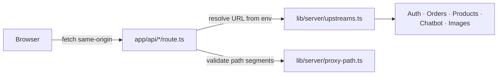

# Web application

The UCB Commerce web application is a Next.js 14 storefront and same-origin
backend-for-frontend (BFF). Browser code calls only `/api/*`; server-side
Route Handlers forward those requests to the private Auth, Orders, Products,
Chatbot, and Images services. See the [root README](../../README.md) for
system architecture and cross-service decisions.

## Architecture



## Key decisions

- **The browser never receives a backend URL.** Every service call is
  proxied through a Route Handler under `app/api/`; upstream base URLs are
  resolved server-side from environment (`lib/server/upstreams.ts`) and
  validated as well-formed `http(s)` URLs before use.
- **Proxied path segments are decoded and re-validated, not passed through
  raw**, closing path-traversal and double-encoding tricks
  (`lib/server/proxy-path.ts: encodedPathSuffix` — multi-pass percent-decode
  with rejection of `.`, `..`, separators, and control characters).
- **Upload size is enforced at the edge before the body is even fully read**:
  the products proxy checks a declared image-size header and `Content-Length`
  against the 4 MiB original-image / 4,450,000-byte multipart caps, then
  streams the body with a hard byte ceiling rather than buffering an
  unbounded request (`app/api/products/[[...path]]/route.ts`).
- **The chat route adds its own defenses on top of the chatbot service's**:
  a per-client token-bucket rate limit (12 req/60s, LRU-bounded to 10k
  tracked clients), a 96 KiB payload cap, and streaming UTF-8 decoding with
  `fatal: true` so malformed byte sequences are rejected outright
  (`app/api/chat/route.ts`).
- **The chat widget re-validates navigation client-side**, independently of
  the backend's own allowlist in `navigate_tool` — same-origin check, static
  path allowlist, and per-segment validation for `/products/*` and
  `/careers/*` (`components/chat-widget.tsx: safeNavigationPath`). A
  compromised or buggy backend still can't send a user off-origin.

## Route handler map

| Route | Proxies to |
|---|---|
| `app/api/auth/[[...path]]` | Auth service |
| `app/api/users/[[...path]]` | Auth service |
| `app/api/careers/[[...path]]` | Auth service |
| `app/api/orders/[[...path]]` | Orders service |
| `app/api/products/[[...path]]` | Products service |
| `app/api/cart/[[...path]]` | Products service |
| `app/api/chat` | Chatbot service |
| `app/api/images/[id]` | Images service |

## Environment

Copy `.env.example` to `.env.local`. The Firebase values prefixed with
`NEXT_PUBLIC_` are intentionally included in the browser bundle. Service URLs
are server-only:

- `AUTH_API_URL`
- `ORDERS_API_URL`
- `PRODUCTS_API_URL`
- `CHATBOT_API_URL`
- `IMAGE_SERVICE_BASE_URL`

Docker Compose and Vercel service bindings override those URLs for their
respective networks.

## Direct development

```bash
corepack enable
pnpm install --frozen-lockfile
pnpm dev
```

The standalone production build used by Docker is:

```bash
pnpm build
node .next/standalone/server.js
```

This directory is part of the UCB Commerce monorepo. Run the full system
from the repository root with `docker compose up --build`.
