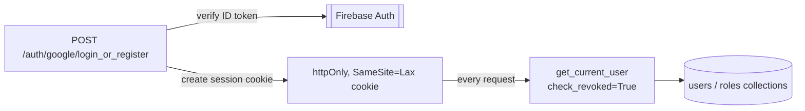

# Auth service

FastAPI service for Firebase authentication, session cookies, user profiles,
careers, and career-scoped role administration in UCB Commerce. See the
[root README](../../README.md) for system architecture and cross-service
decisions.

## Architecture



## Key decisions

- **Session cookies over bare ID tokens for browser sessions.** Firebase
  session cookies are verified with `check_revoked=True` on every request,
  including inside the 15-second clock-skew retry path
  (`_verify_session_with_skew` / `_verify_id_token_with_skew` in
  `app/deps/auth.py` and `app/routers/auth.py`) — a retry for clock drift
  never becomes a way to skip the revocation check.
- **Logout revokes all of a user's refresh tokens**, not just the current
  cookie: Firebase cannot invalidate a single session cookie individually, so
  `fb_auth.revoke_refresh_tokens(uid)` is the closest available primitive.
  Accepted trade-off: logging out on one device ends every session for that
  user.
- **Roles live in a separate `roles` collection**, not on the user profile:
  `{ roles: ["student"|"admin", ...], platform_admin: bool, admin_careers:
  [...] }`. `platform_admin` bypasses all career scoping; an `admin` can only
  manage careers listed in their own `admin_careers`.
- **Account deletion is best-effort and ordered for safety:** refresh tokens
  are revoked before the Firebase user is deleted, and Firestore profile/role
  cleanup happens after — if that cleanup fails, the user is still gone from
  Firebase Auth, so `check_revoked=True` elsewhere still prevents the deleted
  account's old session from being reused.

## API surface

- `POST /auth/google/login_or_register` — verify a Google ID token, mint a
  session cookie, materialize the user profile and default `student` role.
- `POST /auth/session/logout` — revoke sessions, expire the cookie.
- `POST /auth/token/refresh` — exchange a refresh token via Firebase's
  Secure Token API.
- `GET /users/me`, `POST /users/me/profile`, `DELETE /users/me` — profile
  read/update/delete.
- `POST /users/roles/make_admin`, `.../remove_admin`,
  `.../make_platform_admin`, `.../remove_platform_admin` — role management,
  permission-checked against the requester's own roles doc.
- `GET /careers`, `GET /careers/public`, `POST /careers` — career catalog.

## Configuration

Required: `ALLOWED_ORIGINS`, the `FIREBASE_*` service-account fields,
`FIREBASE_WEB_API_KEY`.

Also used: `ENABLE_FIRESTORE_PROVISIONING`, `SESSION_COOKIE_NAME`,
`SESSION_EXPIRES_HOURS`, `SESSION_COOKIE_DOMAIN`, `SESSION_COOKIE_SECURE`.
Set `SESSION_COOKIE_SECURE=true` in any environment served over HTTPS.

## Development

```bash
python -m pip install -r requirements.txt pytest
uvicorn app.main:app --reload --port 8001
pytest
```

13 tests covering session cookie lifecycle, the revocation-preserving
clock-skew retry, account-deletion cleanup ordering, and CORS credential
policy — all against a stubbed Firebase Admin SDK, no live project required.

This service is part of the UCB Commerce monorepo. Run the full system from
the repository root with `docker compose up --build`.
