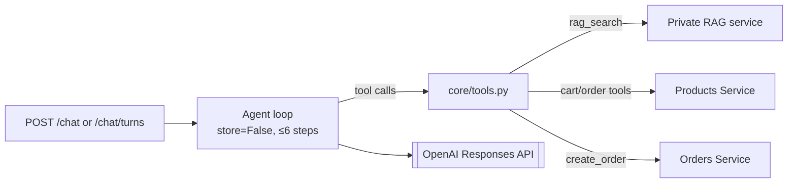

# Chatbot service

FastAPI service for the UCB Commerce conversational shopping agent. It runs a
bounded tool-calling loop against the OpenAI Responses API and a
Firestore Vector Search retrieval index. See the [root README](../../README.md) for
the full system architecture, the agent's confirmation model, and the
security rationale — this file covers the service in isolation.

## Architecture



## Key decisions

- **Model:** configurable via `OPENAI_CHAT_MODEL` (defaults to
  `gpt-5.6-terra`); never hardcode a model name in new code.
- **Stateless turns:** the Responses API is called with `store=False`, so the
  server holds no conversation memory — every `response.output` item
  (including reasoning) is replayed within a turn to keep multi-step tool use
  coherent.
- **Bounded and defensive by construction:** at most 6 reasoning steps per
  turn; contiguous read-only tool calls run concurrently
  (`asyncio.gather`); at most one mutating tool executes per step and the
  agent must observe its result before trying again; the final step never
  executes tools, only reports the step limit was reached.
- **Mutations require confirmation outside the model.** The v2 API returns a
  five-minute HMAC-signed action token bound to the session, exact tool
  arguments, and an idempotency key. `/chat/confirmations` executes it after
  a visual approval; Products and Orders make retries safe. The legacy
  endpoint retains its literal phrases only for rollback compatibility.
- **RAG output is untrusted data.** Every retrieved chunk is wrapped as
  `{"untrusted_data": true, "source": "rag", "content": ...}`; the system
  prompt forbids treating it as instructions.
- **Low-latency delivery:** Responses API text deltas are forwarded as they
  arrive; tool phases emit `tool.status`; Products, Orders, and RAG calls share
  one keep-alive HTTP connection pool.

## Endpoints

- `GET /`: basic service status.
- `GET /health`: liveness check.
- `POST /chat`: the agent endpoint.
- `POST /chat/turns`: v2 SSE endpoint with typed UI actions, renderables, and
  confirmation events.
- `POST /chat/confirmations`: approve or reject a signed pending command.
- `POST /chat/actions/receipt`: receive the browser's action result.
- `POST /upload`: ingest a plain-text document into the RAG index.

`POST /chat` request:

```json
{
  "question": "Busca una mochila y agrégala al carrito",
  "history": [
    {"sender": "user", "text": "Hola"},
    {"sender": "bot", "text": "¿En qué te ayudo?"}
  ],
  "current_page": "/catalog"
}
```

Response:

```json
{
  "answer": "Respuesta para el usuario",
  "trace": [],
  "cost": 0.0
}
```

`trace` contains only sanitized tool calls and results (capped at 500
characters each) — it never exposes model reasoning. `cost` is computed from
actual token usage across four billing classes (see the root README's
"Cost engineering" section).

## Tools

`rag_search_tool` · `search_products_tool` · `get_products_tool` ·
`compare_products_tool` · `get_cart_tool` · `list_my_orders_tool` ·
`add_to_cart_tool` · `set_cart_quantity_tool` · `remove_from_cart_tool` ·
`clear_cart_tool` · `create_order_tool` · `navigate_tool` ·
`catalog_control_tool` · `select_product_quantity_tool` ·
`highlight_products_tool`

Authenticated tools detect the session cookie named by `SESSION_COOKIE_NAME`
and return `"AUTH_REQUIRED"` when it's missing, which the loop turns into a
login navigation command rather than a raw error.

## Configuration

Required: `OPENAI_API_KEY`, `INTERNAL_API_TOKEN`, and in production a distinct
`CHAT_ACTION_SIGNING_SECRET`.

Optional (defaults shown): `OPENAI_CHAT_MODEL` (`gpt-5.6-terra`),
`OPENAI_REASONING_EFFORT` (`low`), `OPENAI_MAX_OUTPUT_TOKENS` (`900`),
`OPENAI_RESPONSE_VERBOSITY` (`low`),
`OPENAI_INPUT_PRICE_PER_M`, `OPENAI_CACHED_INPUT_PRICE_PER_M`,
`OPENAI_OUTPUT_PRICE_PER_M`, `PRODUCTS_API_URL`, `ORDERS_API_URL`,
`SESSION_COOKIE_NAME`, `CHAT_SESSION_COOKIE_NAME`, `ALLOWED_ORIGINS`,
`CORS_ALLOW_CREDENTIALS`.

Price env vars exist so the reported `cost` field tracks whatever the OpenAI
account is actually billed on a given deployment date. If `ALLOWED_ORIGINS`
contains `*`, the service forces `CORS_ALLOW_CREDENTIALS=false`.

## Development

```bash
python -m pip install -r requirements-dev.txt
uvicorn app.main:app --reload --port 8004
pytest
```

55 tests, fully offline — OpenAI, RAG, Products, and Orders are all
mocked. Representative cases: `test_only_one_mutating_tool_executes_per_model_step`,
`test_bound_confirmation_is_consumed_after_one_mutation`,
`test_rag_results_are_marked_as_untrusted_data`,
`test_agent_never_executes_a_mutation_on_the_final_model_round`.

This service is part of the UCB Commerce monorepo. Run the full system from
the repository root with `docker compose up --build`.
