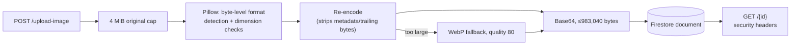

# Images service

FastAPI service that validates, normalizes, stores, and serves product
images. Image bytes are Base64-encoded and persisted directly in Firestore;
the container filesystem holds no durable state. See the
[root README](../../README.md) for system architecture and cross-service
decisions.

## Architecture



## Key decisions

- **Firestore document storage instead of an object-storage bucket.** Avoids
  standing up a second storage system and a second auth boundary for a
  catalog whose images are small. Accepted trade-off: a hard ceiling of
  983,040 Base64 bytes per image (Firestore's 1 MiB document limit minus a
  64 KiB safety margin for field names and encoding overhead), with a WebP
  re-encode attempted before outright rejection.
- **Never trust the declared upload MIME type or filename extension.**
  Pillow opens the raw bytes and reports the actual format; only JPEG, PNG,
  and WebP are accepted, animated images are rejected (`n_frames != 1`), and
  `DecompressionBombWarning` is escalated to an error so a crafted image
  can't exhaust memory during decode.
- **Every stored image is re-encoded, not passed through.** This strips EXIF
  metadata and any trailing bytes appended after the image data (a common
  polyglot-file trick), and derives the served `Content-Type` and filename
  extension from the re-encoded format rather than from user input.
- **Every image response carries defensive headers** —
  `Content-Security-Policy: default-src 'none'; sandbox`,
  `X-Content-Type-Options: nosniff`,
  `Cross-Origin-Resource-Policy: same-origin` — enforced here and mirrored by
  the Next.js image proxy (`apps/web/app/api/images/[id]/route.ts`) so a
  stored image can never be interpreted as executable content by a browser.

## Configuration

```dotenv
MAX_B64_BYTES=983040
MAX_IMAGE_WIDTH=8192
MAX_IMAGE_HEIGHT=8192
MAX_IMAGE_PIXELS=25000000
```

`MAX_B64_BYTES` is always clamped to 983,040 regardless of what's configured
higher. Also required: the `FIREBASE_*` service-account fields,
`FIREBASE_COLLECTION` (defaults to `images`), `ALLOWED_ORIGINS`.

This service has no authentication of its own — it relies on network
isolation (only `web` and `products` can reach it). See the root README's
Known limitations.

## API surface

- `POST /upload-image` — validate, normalize, store; returns the document ID.
- `GET /{image_id}` — stream the stored image with derived MIME/filename.
- `PUT /{image_id}` — replace a stored image, same validation pipeline.
- `DELETE /{image_id}` — remove the Firestore document.

## Development

```bash
python -m pip install -r requirements.txt pytest
uvicorn main:app --reload --port 8005
pytest
```

11 tests covering upload size limits, format/dimension validation, and
response security headers.

This service is part of the UCB Commerce monorepo. Run the full system from
the repository root with `docker compose up --build`. The Docker image uses
Python 3.12, listens on the platform-provided `PORT`, and runs as a non-root
user.
