# Images service

FastAPI service that validates, normalizes, stores, and serves product
images. Image bytes are Base64-encoded and persisted directly in Firestore;
the container filesystem holds no durable state. See the
[root README](../../README.md) for system architecture and cross-service
decisions.

## Architecture

```mermaid
graph LR
    Upload["POST /upload-image"] --> Limit["4 MiB original cap"]
    Limit --> Pillow["Pillow: byte-level format\ndetection + dimension checks"]
    Pillow --> Downscale["Downscale to a\n1600px long edge"]
    Downscale --> Reencode["Re-encode as WebP\n(strips metadata/trailing bytes)"]
    Reencode -->|too large| WebPFallback["WebP retry, quality 80"]
    Reencode --> B64["Base64, ≤983,040 bytes"]
    WebPFallback --> B64
    B64 --> Firestore[(Firestore document)]
    Firestore --> Serve["GET /{id}[?w=variant]\nETag + immutable cache + security headers"]
```



## Key decisions

- **Firestore document storage instead of an object-storage bucket.** Avoids
  standing up a second storage system and a second auth boundary for a
  catalog whose images are small. Accepted trade-off: a hard ceiling of
  983,040 Base64 bytes per image (Firestore's 1 MiB document limit minus a
  64 KiB safety margin for field names and encoding overhead), with a WebP
  retry at a lower quality attempted before outright rejection.
- **Never trust the declared upload MIME type or filename extension.**
  Pillow opens the raw bytes and reports the actual format; only JPEG, PNG,
  and WebP are accepted, animated images are rejected (`n_frames != 1`), and
  `DecompressionBombWarning` is escalated to an error so a crafted image
  can't exhaust memory during decode. On read, a stored image's MIME/filename
  are re-derived the same way — either the full Pillow pass (when resizing
  for a `?w=` variant) or a cheap magic-byte sniff (on the plain passthrough
  path, safe because the bytes were already fully validated at upload time
  and are never re-decoded there).
- **Every stored image is re-encoded, not passed through.** This strips EXIF
  metadata and any trailing bytes appended after the image data (a common
  polyglot-file trick). Originals are also downscaled to a 1600px long edge
  (`MAX_STORED_IMAGE_EDGE`) and always encoded as WebP — this is a *storage*
  optimization applied only after the 8192×8192 / 25M-pixel upload limits are
  enforced, so it never changes whether an upload is accepted, only how many
  bytes the accepted result takes. The `MAX_B64_BYTES` ceiling itself is
  unchanged.
- **Read-path responses are cacheable and immutable.** Every 200/304 carries
  a strong `ETag` (derived from the stored Base64 payload) and
  `Cache-Control: public, max-age=31536000, immutable`. This is honest
  because an image ID never changes content — `services/products` always
  uploads a new ID on both create and update, and this service does not
  expose a "replace bytes at this ID" endpoint.
- **Every image response carries defensive headers** —
  `Content-Security-Policy: default-src 'none'; sandbox`,
  `X-Content-Type-Options: nosniff`,
  `Cross-Origin-Resource-Policy: same-origin` — enforced here and mirrored by
  the Next.js image proxy (`apps/web/app/api/images/[id]/route.ts`) so a
  stored image can never be interpreted as executable content by a browser.
- **Read/list/delete handlers are synchronous (`def`, not `async def`).**
  They do blocking work (firebase-admin's synchronous Firestore client,
  Pillow). FastAPI dispatches sync path operations to a threadpool rather
  than running them on the event loop, so concurrent image requests are no
  longer served one at a time. `IMAGE_THREADPOOL_SIZE` bounds how many can
  run at once (raised at startup in `main.py`).

## Configuration

```dotenv
MAX_B64_BYTES=983040
MAX_IMAGE_WIDTH=8192
MAX_IMAGE_HEIGHT=8192
MAX_IMAGE_PIXELS=25000000
MAX_STORED_IMAGE_EDGE=1600
IMAGE_THREADPOOL_SIZE=24
IMAGE_VARIANT_WIDTHS=96,320,640
IMAGE_VARIANT_CACHE_BYTES=33554432
```

`MAX_B64_BYTES` is always clamped to 983,040 regardless of what's configured
higher. Also required: the `FIREBASE_*` service-account fields,
`FIREBASE_COLLECTION` (defaults to `images`), `ALLOWED_ORIGINS`.

This service has no authentication of its own — it relies on network
isolation (only `web` and `products` can reach it). See the root README's
Known limitations. Because there is no auth, this service must never gain a
public `vercel.json` rewrite of its own — mutating endpoints (`POST`,
`DELETE`) would become reachable without going through the web proxy's
content-type allowlist.

## API surface

- `POST /upload-image` — validate, normalize, downscale, store as WebP;
  returns the document ID.
- `GET /{image_id}` — the stored image, with MIME/filename derived from its
  bytes, an `ETag`, and an immutable `Cache-Control`. Honors `If-None-Match`
  (304, no body). Add `?w=<width>` (one of `IMAGE_VARIANT_WIDTHS`) to get an
  on-demand-resized WebP variant instead of the original; a disallowed width
  is rejected with 400. Variants are served from a bounded in-process LRU
  cache keyed by (image ID, width, ETag).
- `HEAD /{image_id}` — same headers as `GET`, no body.
- `DELETE /{image_id}` — remove the Firestore document.

There is no `PUT /{image_id}`: every caller in this codebase uploads a new
image (new ID) on both create and update, so a mutating "replace" endpoint
was dead code and would have made the immutable `Cache-Control` above
dishonest.

## Development

```bash
python -m pip install -r requirements.txt pytest
uvicorn main:app --reload --port 8005
pytest
```

Covers upload size limits, format/dimension/downscale validation, the
magic-byte read-path sniff, response security headers, ETag/`If-None-Match`/
`Cache-Control` behavior (via `fastapi.testclient`), and `?w=` variant
rendering/caching. No test hits real Firebase — `firebase_client` is stubbed
before `main` is imported.

Backfilling existing images to the downscaled/WebP pipeline (run locally
against Firestore, never as an HTTP endpoint — this service has no auth):

```bash
python scripts/backfill_downscale.py --dry-run   # preview
python scripts/backfill_downscale.py             # apply
```

This service is part of the UCB Commerce monorepo. Run the full system from
the repository root with `docker compose up --build`. The Docker image uses
Python 3.12, listens on the platform-provided `PORT`, and runs as a non-root
user.
