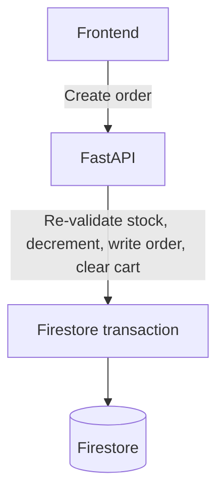

# Orders service

FastAPI service for the UCB Commerce order lifecycle: checkout, status
tracking, and career-scoped admin views. See the
[root README](../../README.md) for system architecture and cross-service
decisions.

## Architecture



## Key decisions

- **Checkout is one Firestore transaction, not a multi-step saga.** Stock is
  pre-validated once outside the transaction (for a fast-fail on obviously
  insufficient stock), then re-read and re-validated *inside* a
  `@firestore.transactional` function alongside the stock decrement, the
  order write, and the cart deletion (`app/routers/orders.py: create_order`).
  Firestore transactions are serializable, so if two requests race for the
  last unit of an item, only one commits — the other observes the updated
  stock and fails with `409`. This guarantees no oversell without needing a
  distributed lock or a separate reservation service.
- **Orders follow a fixed status progression** (`pending → confirmed →
  shipped → delivered`), enforced at the API layer so a status update can't
  skip backward or jump stages arbitrarily.
- **Admin visibility is career-scoped**, mirroring Products: a `platform_admin`
  sees every order; a career `admin` sees only orders whose `career_tags`
  intersect the careers they administer (`visible_careers_for`).

## API surface

- `GET /orders/me` — the authenticated user's own orders.
- `POST /orders` — create an order from the current cart.
- `GET /orders`, `GET /orders/pending-count` — admin listing, career-scoped.
- Status transition endpoints for admins (see `app/routers/orders.py`).

## Configuration

Required: the `FIREBASE_*` service-account fields, `SESSION_COOKIE_NAME`.

Also used: `ALLOWED_ORIGINS`, `ENABLE_FIRESTORE_PROVISIONING`,
`SESSION_EXPIRES_HOURS`, `SESSION_COOKIE_DOMAIN`, `SESSION_COOKIE_SECURE`,
`IMAGE_SERVICE_BASE_URL`.

## Development

```bash
python -m pip install -r requirements.txt
uvicorn app.main:app --reload --port 8002
```

This service does not yet have an automated test suite — the root README
lists it as a known gap, since every other backend service does.

This service is part of the UCB Commerce monorepo. Run the full system from
the repository root with `docker compose up --build`.
