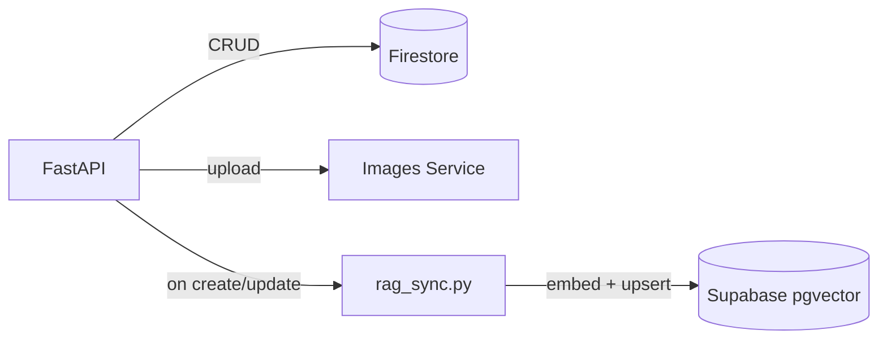

# Products service

FastAPI service for the UCB Commerce catalog, cart, and inventory. It is the
source of truth for product data, and the write path that keeps the chatbot's
retrieval index current. See the [root README](../../README.md) for system
architecture and cross-service decisions.

## Architecture



## Key decisions

- **Firestore over a relational store.** Product attributes vary a lot across
  categories (textbooks vs. lab equipment vs. merchandise), so a flexible
  document schema avoids a sparse, ever-growing set of nullable relational
  columns.
- **RAG sync runs inline on the write path**, not through a queue: a product
  create/update calls `sync_product_to_rag`, which deletes any existing
  chunks for that product and inserts a fresh one, keyed by a deterministic
  `UUIDv5` derived from the Firestore ID (`app/core/rag_sync.py`). This keeps
  the catalog and the vector index from drifting under normal operation; a
  transient embedding failure is logged and swallowed rather than retried
  (documented as a known limitation in the root README).
- **Career-scoped RBAC.** Managing a product requires the `admin` role for
  its career, or `platform_admin`. Moving a product between careers requires
  authority over **both** the source and destination career
  (`app/deps/permissions.py: can_move_product_or_403`) — an admin for one
  career cannot use a reassignment to take over inventory that belongs to
  another.
- **Image uploads are proxied, not stored here.** `app/services/images.py`
  forwards the multipart upload to the Images service (which does the actual
  validation/re-encoding) and stores back only the resulting `/api/images/{id}`
  path.

## Cart → order handoff

The cart lives in Firestore under `carts/{uid}`. `services/orders` reads it
directly when creating an order: it re-validates stock for every item inside
a Firestore transaction (re-reading current stock, rejecting if it changed),
decrements stock, writes the order, and clears the cart — all as one atomic
transaction, so two concurrent checkouts against the last unit of stock
cannot both succeed. See `services/orders/app/routers/orders.py: create_order`.

## API surface

- `GET /api/products/public`, `GET /api/products/{id}` — public catalog read.
- `GET|POST /api/products` — authenticated list/create.
- `POST /api/products/form` — create with a multipart image upload.
- `GET|PUT|DELETE` cart endpoints under `/api/cart` (see `app/routers/cart.py`).

## Configuration

Required: the `FIREBASE_*` service-account fields, `SESSION_COOKIE_NAME`,
`OPENAI_API_KEY`, `SUPABASE_URL`, `SUPABASE_SERVICE_ROLE_KEY`.

Also used: `ALLOWED_ORIGINS`, `ENABLE_FIRESTORE_PROVISIONING`,
`SESSION_EXPIRES_HOURS`, `SESSION_COOKIE_DOMAIN`, `SESSION_COOKIE_SECURE`,
`IMAGE_SERVICE_BASE_URL`, `IMAGE_PUBLIC_BASE_PATH`, `LEGACY_IMAGE_HOSTS`
(read-time compatibility for historical absolute image URLs).

## Development

```bash
python -m pip install -r requirements.txt pytest
uvicorn app.main:app --reload --port 8003
pytest
```

14 tests covering career-scoped permissions, image upload error propagation,
upload size limits, and image URL derivation — all against mocked
Firestore/HTTP, no live credentials required.

This service is part of the UCB Commerce monorepo. Run the full system from
the repository root with `docker compose up --build`.
